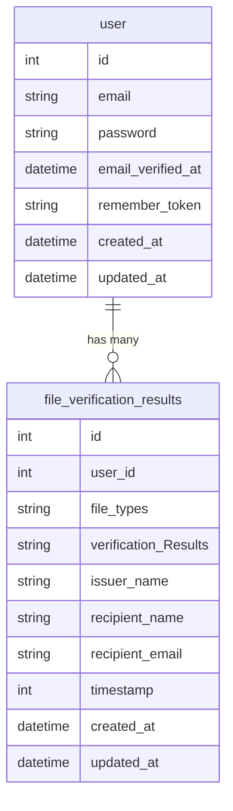
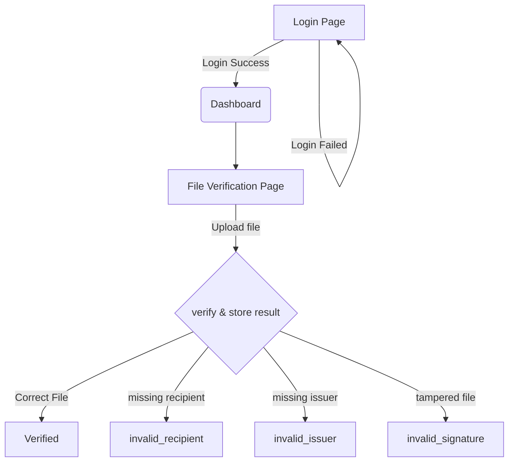

# accredify-assessment

1. [Installation](#Installation)
2. [Entity Relation Diagram](#ERD)
3. [FlowChart](#Flowchart)
4. [Additional Information](#Additional-Information)


## Installation
After Cloning the repository into your local machine, create a new .env file with the .env.example file that was provided in the repository

Although an App key is provided, it would be safer for you to regenerate it with
```bash
php artisan key:generate
```

install the dependencies with composer. 
If you do not have composer you may install it at https://getcomposer.org/download/
```bash
composer install
```
After that you may migrate and seed the database tables and user data (be sure a local MySQL database on port 3306 is active)
```bash
php artisan migrate --seed
```
Because we uses Laravel Breeze to save time for Authentication, you will need to install npm dependencies and build it
if you do not have npm and/or node you could refer to this site to download and install
https://docs.npmjs.com/downloading-and-installing-node-js-and-npm?ref=sfeir.dev

```bash
npm install
npm run build
```
after that you may run the application by using laragon / herd, place them in their designated folders for projects and you may start using it after starting the respective application up.
if using laragon or herd to run the project usually you will be able to access the project with the url: accredify-assessment.test

note* currently the Frontend have issues serving with php artisan serve / php -S commands. Due to time constraints i could not investigate it in depth yet on the issue. 
But the postman with the API will have no issues regardless it is ran with laragon / herd or with php artisan serve.

## ERD


## Flowchart


## Additional Information
you may refer to the POSTMAN API documentations with this link
https://documenter.getpostman.com/view/29577252/2sA3rwNaB6

additionally the postman collection file can be obtain from this drive,
https://drive.google.com/drive/folders/1wvXell39IpRoiKpSAYlhnBTFk_72mrfQ?usp=sharing
